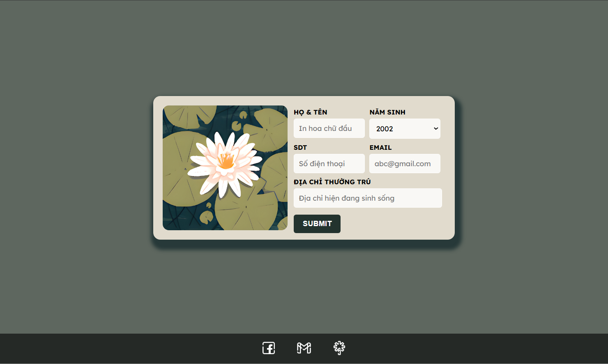

## **PURPOSE OF THE WEBSITE**
Welcome to Linked Google Form Filler! This website is designed to make data entry simpler and more efficient. It allows users to input their information, which is then automatically submitted to a Google Form. This approach minimizes manual data entry and reduces errors, making it easier to handle data collection tasks.

## **EXPLANATION OF THE CODE**
This HTML code creates a form that collects user information and submits it directly to a Google Form. The form does not display the Google Form itself but instead uses hidden fields to send data to the form's backend. Here’s a breakdown of how it works:
___
1. **Form Tag Attributes:**
```html
<form id="registrationForm" action="https://docs.google.com/forms/u/0/d/e/1FAIpQLSec7EFg6nB7F1lJAduuXCVeLk-qA1HOBqiRFapLoxlxjZTcMg/formResponse" method="POST" target="_blank" autocomplete="off">
```
- `action`: URL of the Google Form where the data will be submitted.
- `method`: The HTTP method used for the request (`POST` is used here to send data).
- `target`: Specifies where to open the response. `_blank` opens the response in a new tab.
- `autocomplete`: Set to `off` to prevent the browser from suggesting previously entered values.
___
2. **Form Fields:**
Each field collects specific data and is linked to corresponding Google Form fields through the `name` attribute. For example:
```html
<input type="text" id="name" name="entry.636287609" required placeholder="In hoa chữ đầu">
```
- `name="entry.636287609"`: Maps to a specific field in the Google Form for the user's name.
- `name="entry.259393673"`: Maps to a field for the phone number.
Each `<input>` or `<select>` element uses these `name` attributes to correspond to the fields in the Google Form. When the form is submitted, the data is sent to the Google Form as if it was filled out directly.
_NOTE: You can open yout Google Form and inspect the form fields using browser developer tools (usually by right-clicking the form and selecting "Inspect" or "Inspect Element") to find the `name` attributes of each field._
___
3. **Form Layout:**
The form uses `<div>` elements with classes `row` and `column` to organize the layout. Each field is placed within a column inside a row, which helps in aligning the form fields properly.
___
4. **Submit Button:**
The button with `type="submit"` sends the form data to the Google Form when clicked.
```html
<button type="submit" id="submitBtn">SUBMIT</button>
```
___
THE END.
