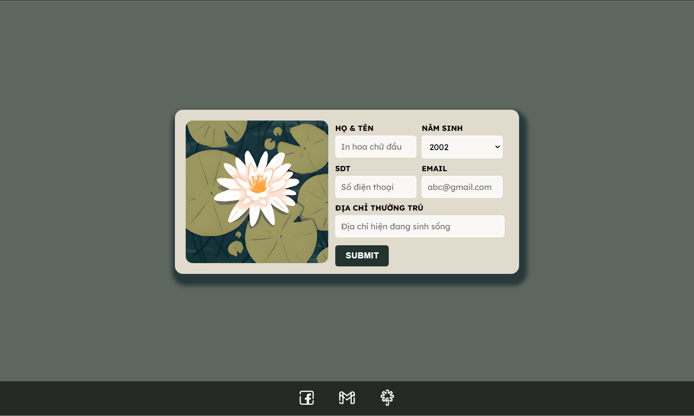

# 💮 Magnolia

	

## Overview

First of all, this is a website that I made for a charity project called **88224**. The project is a website that helps my teammate to fill in the Google Form faster with a good looking design that match the main theme of the entire campaign. The website is made with the most basic things like HTML, CSS, and JavaScript, and it's hosted on GitHub Pages.
